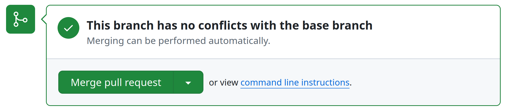
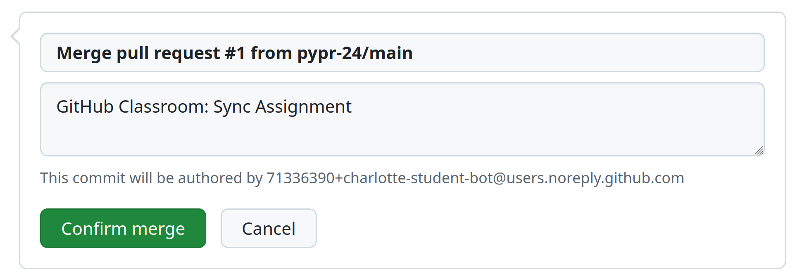

# Python Programming - Lectures

This repository will be updated each week with the code and other materials shown in the Monday lectures.

To download the new materials every week to your own repository:

1. Wait until the lecturer updates the repository after the lecture.
2. When it's done, you will see `#1` just below the green `Code` button; click on it.

3. This will take you to a new page, asking you to "merge" a "pull request". This means incorporating the new code from the lecturer into your own repository.
    - If you don't have any conflicts, you can go to the next step.
    - If you have conflicts, for instance if you've changed the same file as the lecturer, you will need to resolve the conflict before merging (see the Week 2 workshop instructions to learn more about merge conflicts; if you need help, ask a tutor).
4. In any case, once you're happy with the changes, click on "Merge pull request" to get the new code into your repo, Click on "Confirm merge".

